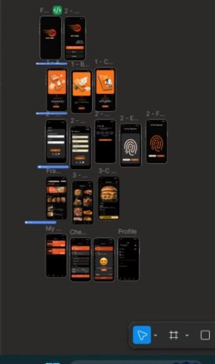
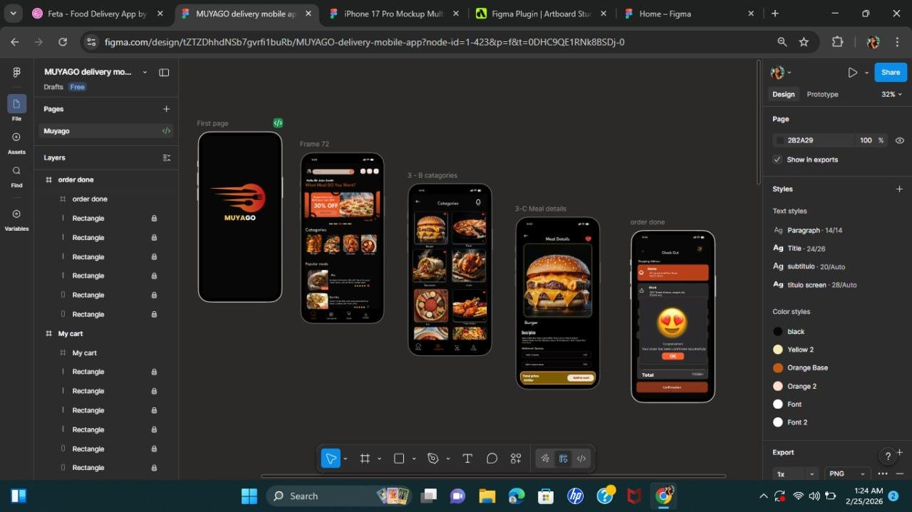
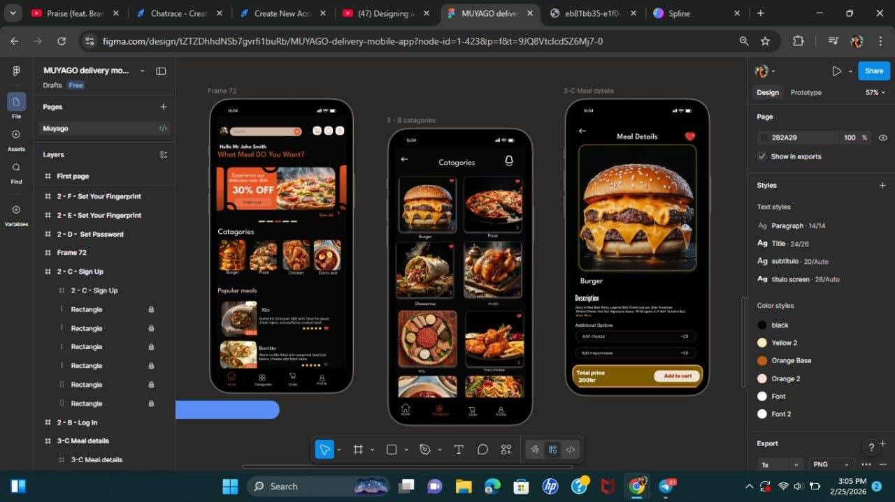

# FUTURE_UX_02
# MUYAGO Food Delivery Mobile App UI

## 📖 Project Overview
MUYAGO is a mobile food delivery application designed to help users easily browse meals, explore categories, and order food quickly. The app focuses on a clean and modern interface that improves the user experience when selecting and purchasing meals.

---

## ❗️ Problem
Many food delivery apps are crowded and confusing, making it difficult for users to quickly find meals and place orders.

---

## 💡 Solution
MUYAGO provides a simple and user-friendly interface where users can easily explore categories, view meal details, and add items to cart without confusion.

---

## 🔄 User Flow
Home → Browse categories → Select meal → View details → Add to cart

---

## 🎯 UX Design Decisions
- Simple bottom navigation for easy movement between screens
- Food categories help users find meals faster
- Large meal images help users decide quickly
- Clear "Add to cart" button improves usability
- Clean layout reduces confusion
- Consistent colors create modern UI

---

## ⭐️ Features
- Browse food categories
- View popular meals
- Detailed meal information
- Add items to cart
- Easy navigation

---

## 🛠 Design Tool
Figma

---

## 📸 Design Preview

### All app Screen UI

### Categories Screen

### Meal Details Screen

